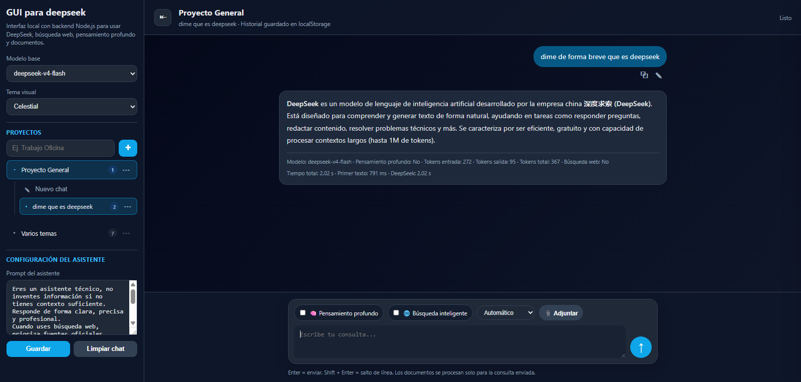

# Open chat API GUI - Deepseek

Interfaz web local para trabajar con modelos de IA vía API, con proyectos, chats, búsqueda web, lectura de documentos, streaming, métricas de tokens y ejecución de código HTML/CSS/JS.

La versión actual está pensada para uso local, pruebas internas y experimentación. Todavía no es una plataforma multiusuario lista para producción.

Actualmente se esta usando el api de deepseek , pero se pueden usar otras api.
---

<p align="center">
  
</p>

## Características principales 

### Espacio conversacional organizado

- Organización de conversaciones por **proyectos** y **chats**.
- Navegación lateral con proyectos desplegables/contraíbles.
- Creación, renombrado, movimiento y eliminación de chats.
- Renombrado y eliminación de proyectos.
- Historial guardado localmente en el navegador mediante `localStorage`.

### Integración con modelos de IA

- Conexión con **DeepSeek API** mediante un backend local en Node.js.
- Selección de modelo base.
- Opción de **Pensamiento profundo**, según soporte del modelo y del payload enviado al backend.
- Respuestas progresivas mediante streaming, para ver el texto mientras se genera.

### Búsqueda web

- Búsqueda web opcional usando **Tavily API**.
- Selección automática o manual del número de resultados de búsqueda.
- Resultados mostrados en un indicador compacto, por ejemplo: `8 páginas web`.
- Panel lateral derecho para consultar las fuentes utilizadas.
- Citas dentro de la respuesta que permiten abrir el panel de fuentes.

### Soporte de documentos

- Adjuntar documentos desde la interfaz.
- Arrastrar y soltar documentos dentro del cuadro de escritura.
- Formatos soportados inicialmente:
  - `.txt`
  - `.md`
  - `.pdf`
  - `.docx`
- Los documentos se procesan temporalmente en el backend para usarse como contexto de la consulta actual.

### Soporte para generación de código

- Renderizado Markdown para las respuestas.
- Bloques de código con resaltado de sintaxis usando Highlight.js.
- Acciones disponibles en bloques de código:
  - Copiar código.
  - Descargar código.
  - Ejecutar HTML/CSS/JavaScript en una vista previa aislada mediante `iframe`.
- Renderizado seguro de respaldo si falla el resaltado de sintaxis.

### Experiencia de usuario

- Temas visuales: **Celestial**, **Oscuro** y **Claro**.
- Columna de lectura centrada.
- Cuadro de escritura centrado.
- Auto-scroll inteligente durante el streaming.
- Botón para detener la generación de respuesta.
- Acciones para copiar y editar prompts del usuario.
- Metadatos por respuesta:
  - Modelo usado.
  - Estado de búsqueda web.
  - Tokens utilizados.
  - Tiempo hasta el primer texto.
  - Tiempo total de respuesta.
  - Tiempo de búsqueda web.
  - Tiempo de procesamiento de documentos.

---

## Tecnologías utilizadas

- **Frontend:** HTML, CSS y JavaScript.
- **Backend:** Node.js + Express.
- **API de IA:** DeepSeek API.
- **Búsqueda web:** Tavily API.
- **Lectura de documentos:** `pdf-parse` y `mammoth`.
- **Carga de archivos:** `multer`.
- **Resaltado de código:** Highlight.js vía CDN.

---

## Estructura del proyecto

```text
.
├── server.js
├── package.json
├── package-lock.json
├── .env.example
├── .gitignore
├── README.md
└── public/
    ├── index.html
    ├── style.css
    └── app.js
```

### Archivos principales

| Archivo | Descripción |
|---|---|
| `server.js` | Backend en Node.js. Contiene las rutas API, integración con DeepSeek, búsqueda Tavily, procesamiento de documentos y streaming. |
| `public/index.html` | Estructura principal de la interfaz. |
| `public/style.css` | Diseño visual, temas, layout, estilos de mensajes y bloques de código. |
| `public/app.js` | Lógica del frontend: proyectos, chats, mensajes, renderizado, drag & drop, streaming y acciones sobre código. |
| `.env.example` | Plantilla de variables de entorno. |
| `package.json` | Metadatos, scripts y dependencias del proyecto. |

---

## Requisitos

- Node.js **18 o superior**.
- npm.
- API Key de DeepSeek.
- API Key de Tavily, opcional pero necesaria para usar búsqueda web.

Verifica tu versión de Node.js:

```bash
node -v
```

---

## Instalación

Clona el repositorio:

```bash
git clone https://github.com/TU_USUARIO/TU_REPOSITORIO.git
cd TU_REPOSITORIO
```

Instala las dependencias:

```bash
npm install
```

---

## Variables de entorno

Crea un archivo `.env` tomando como base `.env.example`:

```bash
cp .env.example .env
```

En Windows PowerShell puedes usar:

```powershell
Copy-Item .env.example .env
```

Luego edita el archivo `.env`:

```env
# Clave API de DeepSeek
DEEPSEEK_API_KEY=tu_clave_deepseek

# Clave API de Tavily para búsqueda web
TAVILY_API_KEY=tu_clave_tavily

# Puerto local
PORT=3010

# Endpoint de DeepSeek
DEEPSEEK_API_URL=https://api.deepseek.com/chat/completions

# Cantidad máxima de caracteres extraídos de documentos y enviados como contexto
MAX_DOCUMENT_CHARACTERS=30000
```

No subas tu archivo `.env` a GitHub.

---

## Ejecutar la aplicación

Inicia el servidor local:

```bash
npm run dev
```

Luego abre en tu navegador:

```text
http://localhost:3010
```

Para detener el servidor, presiona:

```text
Ctrl + C
```

---

## Cómo usar la aplicación

### Crear proyectos y chats

1. Crea un proyecto desde el panel lateral izquierdo.
2. Abre el proyecto para visualizar sus chats.
3. Crea un nuevo chat dentro del proyecto seleccionado.
4. Usa el menú `⋯` para renombrar, mover o eliminar chats.

### Usar búsqueda web

1. Activa **Búsqueda inteligente** en el cuadro de escritura.
2. Selecciona búsqueda automática o un número fijo de resultados.
3. Realiza una consulta que requiera información actualizada.
4. Haz clic en el indicador de páginas web para revisar las fuentes consultadas.

### Adjuntar documentos

Puedes adjuntar documentos de dos formas:

- Haciendo clic en el botón de adjuntar.
- Arrastrando y soltando un archivo compatible dentro del cuadro de escritura.

El backend extrae texto del documento y lo envía como contexto para la consulta actual.

### Generar, copiar, descargar y ejecutar código

Cuando el modelo devuelve un bloque de código, la interfaz permite:

- Copiar el código.
- Descargarlo como archivo.
- Ejecutar HTML/CSS/JavaScript en una vista previa aislada.

La ejecución está pensada únicamente para ejemplos de código de navegador.

---

## Almacenamiento de datos y privacidad

Actualmente, el proyecto guarda los datos visibles del usuario localmente en el navegador.

| Dato | Dónde se almacena |
|---|---|
| Proyectos | `localStorage` del navegador. |
| Chats | `localStorage` del navegador. |
| Mensajes | `localStorage` del navegador. |
| Configuración visual | `localStorage` del navegador. |
| API Keys | Archivo `.env` en la máquina donde corre el backend. |
| Archivos adjuntos | Procesados temporalmente en memoria por el backend. |
| Texto extraído de documentos | Enviado al proveedor de IA como contexto de la consulta. |

Notas importantes:

- DeepSeek no conoce automáticamente el historial de tus proyectos. La aplicación envía el historial relevante como contexto en cada consulta.
- Los archivos adjuntos no se guardan permanentemente en esta versión.
- Si una respuesta contiene información sensible de un documento, esa respuesta puede quedar guardada en el historial local del navegador mediante `localStorage`.
- Esta aplicación todavía no incluye login, roles de usuario, base de datos persistente ni cifrado del historial.

---

## Notas de seguridad

Este proyecto es adecuado para pruebas locales y experimentación interna.

Antes de usarlo en producción o con múltiples usuarios, considera agregar:

- Autenticación de usuarios.
- Control de acceso por roles.
- Almacenamiento en base de datos.
- Gestión segura y cifrada de secretos.
- Manejo de sesiones en servidor.
- Logs de auditoría.
- Backups.
- Límites de uso.
- Límites de tokens por usuario.
- Política de retención de archivos.
- Endurecimiento del despliegue.

No expongas esta aplicación públicamente sin controles adicionales de seguridad.

---

## Solución de problemas

### `npm` está bloqueado en Windows PowerShell

Si PowerShell bloquea los scripts de npm, puedes usar:

```powershell
npm.cmd install
npm.cmd run dev
```

O ajustar la política de ejecución de PowerShell para tu usuario.

### El puerto ya está en uso

Si el puerto `3010` ya está siendo usado, cambia el puerto en `.env`:

```env
PORT=3020
```

Luego reinicia el servidor.

### La búsqueda web no funciona

Verifica:

1. Que `TAVILY_API_KEY` exista en `.env`.
2. Que hayas reiniciado el backend después de editar `.env`.
3. Que la búsqueda web esté activada en la interfaz.

También puedes revisar el endpoint de salud:

```text
http://localhost:3010/api/health
```

### Las respuestas no aparecen progresivamente

Verifica que estés usando una versión con streaming habilitado y que la ruta `/api/chat-stream` esté funcionando correctamente.

### Los documentos no se procesan

Verifica que el tipo de archivo sea compatible y que el tamaño esté dentro del límite configurado en el backend.

---

## Limitaciones actuales

- El historial se guarda en `localStorage`, no en una base de datos.
- No hay autenticación ni administración multiusuario.
- No existe una biblioteca documental permanente.
- La calidad de la búsqueda web depende del proveedor de búsqueda y de la consulta enviada.
- La ejecución de código está limitada a HTML/CSS/JavaScript en un `iframe` del navegador.
- No se permite ejecución de Python, Node.js u otros lenguajes de sistema por razones de seguridad.

---

## Roadmap sugerido

- Agregar autenticación y usuarios.
- Guardar proyectos y chats en PostgreSQL o SQLite.
- Crear una biblioteca documental persistente por proyecto.
- Agregar prompts o memorias por proyecto.
- Crear un panel administrativo para tokens y costos.
- Agregar selección de proveedor/modelo de IA.
- Exportar e importar proyectos y chats.
- Agregar guía de despliegue en AWS EC2.
- Agregar soporte para Docker.

---

## Licencia

Agrega una licencia antes de publicar el repositorio como público. Si no estás seguro, empieza con un repositorio privado o interno. Usa una licencia estándar como MIT solo si tienes claro que deseas permitir que otros reutilicen el código.

---

## Aviso

Esta es una interfaz experimental local de IA. Revisa siempre el contenido generado por IA antes de usarlo en decisiones técnicas, legales, financieras, comerciales u operativas.
